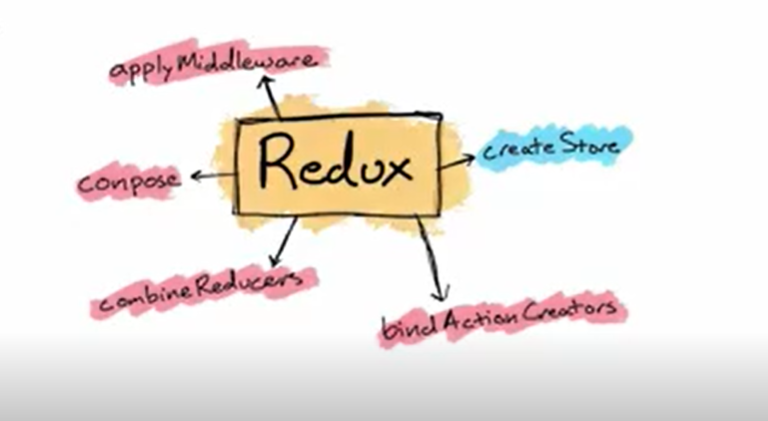

# redux
## Table of Contents
1. [Redux functions](#redux-functions)
2. [composer](#composer)
3. [Create store](#create-store)
4. [Subscribe](#subscribe)
5. [Bind Actions Creator](#bind-actions-creator)
## Redux Functions:
***

## compose
> compose simply do combining the function specifiied as parameters to create a new function . 

## Create Store
>Store take a reducers which are simply a function  (action , state)=>state ....
two things go in (action and state ) and return a state resulting from the previous state and the actions that happend.
state is a data structure that represent your app's data , occasunaly actions will happend that will trigger change on state

```
import {createStore} from "redux";
const initialState = {value :0 };

const reducer  = (state=initialState , action)=>{
    return state;
}


const store  =  configureStore(reducer);
```

>Actions can be called  this way 

```
const initialState = {value :0 };
const reducer  = (state =initialState, action)=>{
    if(action.type=INCREMENT){
        return ({
            ...state,
            value : state.value + action.payload ? action.payload :0, 
        })
    }
    return state;
}

const store  =  createStore(reducer);

const incrementAction = {type : INCREMENT , payload : 5}

const increment =  ()=>{
    return incrementAction
}

store.dispatch(increment())
```

## Subscriber 
>when the any event are triggered the subscrier listenner will be called

```
const subscriber = ()=>console.log("SUBSCRIBER",store.getState())
store.subscribe(subscriber)
```

## Bind Actions Creator

>We can simplify dispatching action by serializing it and bid the actions in a object

```
const actions = bindActionCreators({ increment , cleat } , store.dispatch)
actions.increment()
actions.clear()

```

