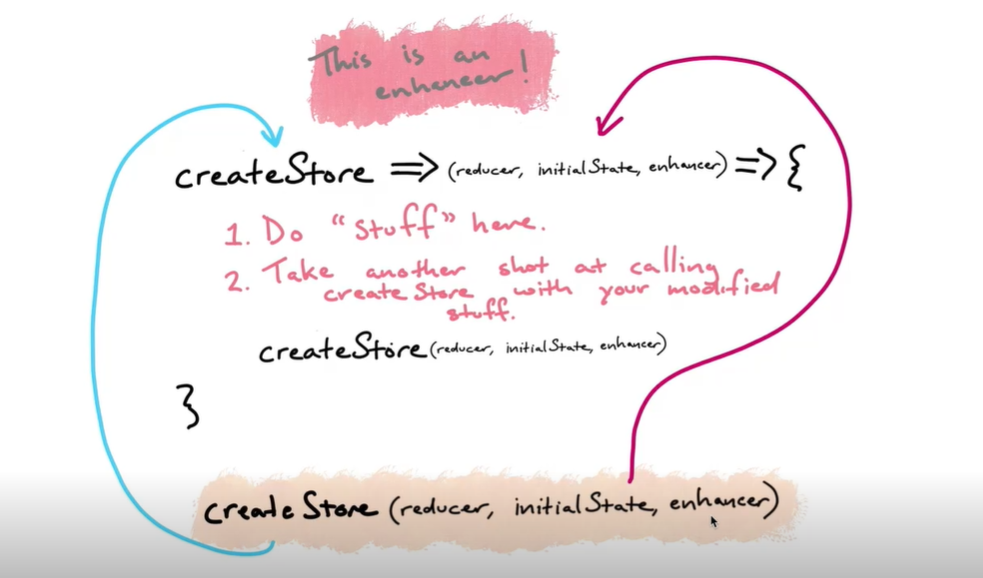

# redux
## Table of Contents
1. [Redux functions](#redux-functions)
2. [composer](#composer)
3. [Create store](#create-store)
4. [Subscribe](#subscribe)
5. [Bind Actions Creator](#bind-actions-creator)
6. [Enhancer](#enhancer)
7. [Middleware](#middleware)
8. [React Redux](#react-redux)
## Redux Functions:
***

## compose
> compose simply do combining the function specifiied as parameters to create a new function . 

## Create Store
>Store take a reducers which are simply a function  (action , state)=>state ....
two things go in (action and state ) and return a state resulting from the previous state and the actions that happend.
state is a data structure that represent your app's data , occasunaly actions will happend that will trigger change on state

```
import {createStore} from "redux";
const initialState = {value :0 };

const reducer  = (state=initialState , action)=>{
    return state;
}


const store  =  configureStore(reducer);
```

>Actions can be called  this way 

```
const initialState = {value :0 };
const reducer  = (state =initialState, action)=>{
    if(action.type=INCREMENT){
        return ({
            ...state,
            value : state.value + action.payload ? action.payload :0, 
        })
    }
    return state;
}

const store  =  createStore(reducer);

const incrementAction = {type : INCREMENT , payload : 5}

const increment =  ()=>{
    return incrementAction
}

store.dispatch(increment())
```

## Subscriber 
>when the any event are triggered the subscrier listenner will be called

```
const subscriber = ()=>console.log("SUBSCRIBER",store.getState())
store.subscribe(subscriber)
```

## Bind Actions Creator

>We can simplify dispatching action by serializing it and bid the actions in a object

```
import {bindActionCreators} from "redux"
const actions = bindActionCreators({ increment , clear } , store.dispatch)
actions.increment()
actions.clear()

```

>another alternative is to use compose

```
const [increment , clear] = [increment , add].map(func=>compose(store.dispatch , func))

```


## Combine Reducers

>we has a nested store has to arrays users and task it begin to be hard to handling this data structure and for bigger project it become more  way harder

```
const { createStore  } = require("redux");

const ADDUSER = "ADDUSER"
const ADDTASK = "ADDTASK"
const initialState = {
    users : [], 
    tasks: []

};
const reducer  = (state =initialState, action)=>{
    if(action.type=ADDUSER){
        return ({
            ...state,
            users : [
                ...state.users , 
                payload
            ]
        })
    }

    if(action.type=ADDTASK){
        return ({
            ...state,
            tasks : [
                ...state.tasks , 
                payload
            ]
        })
    }
    return state;
}

const store  =  createStore(reducer)


```

> we can crate two reducers one for the users and the other  fo the tasks  and combining them into one reducer using "combineReducers"

```
import {combineReducers} from "reduc"
const userReducer  = (users =initialState.users, action)=>{
    if(action.type=ADDUSER){
        return (
            [
                ...users , 
                payload
            ]
        )
    }

   
    return users;
}

const taskReducer  = (tasks =initialState.tasks, action)=>{
    if(action.type=ADDTASK){
        return ( 
            [
                ...tasks , 
                payload
            ]
            )
    }
    return tasks;
}

const reducer =  combineReducers(
    {
        users : userReducer , 
        tasks : taskReducer
    }
)

const store  =  createStore(reducer)

```

>like this we can handle the user seperately from the tasks every one has its one state  therefor they still combined on the  same global state ,

## Enhancer
> enhancer is the third parameters  of the createStore function , it look like a plugin that do some jobs before the actions ;


>example of an enhancer that calculate the time of everu action

```

const monitorEnhancer = (createStore)=>(reducer , initialState , enhancer)=>{
    const monitorReducer = (state , action) =>{
        const start =performance.now()
        const newState =  reducer(state);
        const end  = performance.now()
        const diff = end -  start
        console.log("diff ", diff)

        return  newState
    }
     

    return createStore(monitorReducer , initialState , enhancer)

}

const store  =  createStore(reducer ,initialState ,monitorEnhancer)


```

>This enhancer (logEnhancer) will log the state before and after the actions

```

const logEnhancer = (createStore)=>(reducer , initialState , enhancer)=>{
    const logReducer= (state , action)=>{
        console.log("old State " , state , action)
        const newState =  reducer(state , action);
        console.log("new State " , newState , action)

        return newState

    }

    return createStore(logReducer , initialState , enhancer)
}
```

> We can use  both monitor and logEnhancer by using the compose function

```
const store  =  createStore(reducer ,initialState , compose(monitorEnhancer, logEnhancer))
```

## Middleware


> Enhacers used for modifying the overall implementation of the store  (
    load state  , dispatch actions  , undo , redo  ...etc
)
if we want to modify how dispatch  action  work  we use middlewares (
    example do async call 
)

```

const  logMiddleware = store=>next=>action=>{
    console.log("old State " , action , store.getState())
    next(action)
    console.log("new State " , action , store.getState())

}

const store  =  createStore(reducer ,initialState , 
    applyMiddleware(logMiddleware)
    
)
```

> applyMiddle accept a list of middlewares that will be chains each other as an arguments

```
const store  =  createStore(reducer ,initialState , 
    applyMiddleware(logMiddleware , monitorMiddleware)
    
)
```

## REACT REDUX

> react redux is an intermediary from  react and redux so you can you can use redux as a global store for your react app


> for setting app redux on react we need to  wrap our app with a REDUX provider and pass the store as a parameter
```
  import {Provider} from "react-redux"
  <Provider
    store={store}
  >
    <App />

  </Provider>

```
> so like that we can access the store on the app by using the useSelector function and dispatch actions using useDispatch


```
import { useDispatch, useSelector } from 'react-redux';

import {decrement, increment, reset} from "./actions"

function App() {
  const counter =  useSelector(state=>state.count)
  const dispatch =  useDispatch()
  return (
    <div>
      <p>{counter}</p>

      <div>
        <button onClick={()=>{dispatch(decrement())}}  >decrement</button>
        <button  onClick={()=>{dispatch(reset())}}  >reset</button>
        <button onClick={()=>{dispatch(increment())}}  >increment</button>
      </div>
    
    </div>
  );
}

export default App;

```